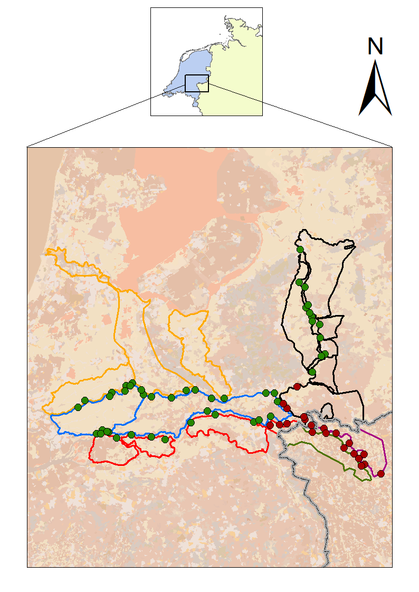
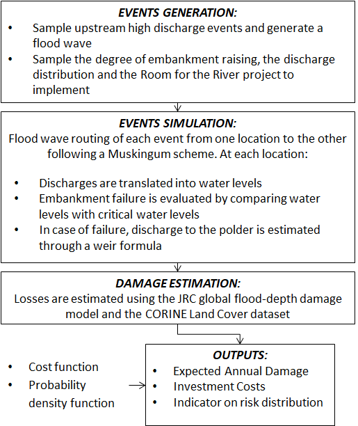

# FloodRiskManagement_model_Rhine: A python-based flood risk assessment model for the lower Rhine River.
## What is the model for?
The model can be used (1) to assess the effect of uncertainties on flood risk through performing exploratory modeling and sensitivity analysis as well as (2) to find optimal combination of measures through many-objective optimization.

## Brief description:
The model allows estimating flood risk by exploring the effect of multiple risk reduction measures accounting for hydrological and dike breaching uncertainties. It is currently set up for the transboundary case of the Lower Rhine River (see in Figure 1), involving Germany and the Netherlands.

||
| ------------- |
| *Figure 1: Study area. Six areas are identified: four Dutch areas (area 0, in red; area 1, in blue; area 2, in orange; area 3, in black) and two German areas (area 4, in green; area 5, in purple). The administrative country border is shown in grey.*          |

The modeling steps are summarized in Figure 2. Flood routing is modelled through a Muskingum scheme which has been benchmarked on results from a SOBEK model calibrated on the case study. Three flood risk reduction measures are possible: embankment heightening, making room for the river and flow diversion at the bifurcation points. Embankments can be raised up to 1 meter, with steps of 10 centimeters. 156 Room for the River projects are available along the Dutch Rhine. The implementation of each project is established through a binary decision variable, which is 1 when it is implemented and 0 otherwise. There are two bifurcation points, and the default flow distributions are the ones provided by the SOBEK model. At each point, a distribution change of plus/minus 30 % of the default distribution can be implemented. 
Outputs in terms of expected annual damage relate to each of the dike ring area; investment costs relate to the each of the implemented measure (or set of measures).

||
| ------------- |
| *Figure 2: The modeling scheme*  |

## Requirements:
- pandas 0.24.2
- ema_workbench and related dependencies: https://github.com/quaquel/EMAworkbench
- SALib: https://github.com/SALib/SALib
- Platypus: https://github.com/Project-Platypus/Platypus

## Application:
A previous version of the model, applied on a smaller scale case study, led to the following open-access publication:

Ciullo, A., Karin M. de Bruijn, Jan H. Kwakkel and Frans Klijn (2019). *Accounting for the uncertain effects of hydraulic interactions in optimising embankments heights: Proof of principle for the IJssel River. Journal of Flood Risk Management, https://doi.org/10.1111/jfr3.12532
